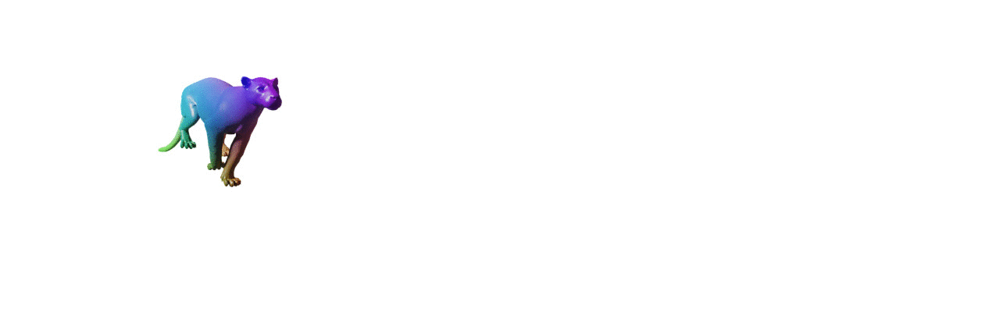

# DeformingThings4D dataset
DeformingThings4D is an synthetic dataset containing 1,972 animation sequences 
spanning 31 categories of humanoids and animals. 


### Animation file (.anime)
*An animation example. Colors indicate dense correspondence*


 
We store an animation sequence in the .anime file.
The first frame is the canonical frame for which we store its triangle mesh.
From the 2nd to the last frame, we store the 3D offsets of the mesh vertices.
```text
#length         #type       #contents
|1              |int32      |nf: number of frames in the animation 
|1              |int32      |nv: number of vertices in the mesh (mesh topology fixed through frames)
|1              |int32      |nt: number of triangle face in the mesh
|nv*3           |float32    |vertice data of the 1st frame (3D positions in x-y-z-order)
|nt*3           |int32      |triangle face data of the 1st frame
|(nf-1)*nv*3    |float32    |3D offset data from the 2nd to the last frame
```

### 1,972 animations
Currently, we provide 200 animations for humanoids and 1772 animations for animals. 
The followings show the structure of the dataset. 
The screenshots show the animations in the dataset.
```text
|---|--humanoids (200 animations, 34228 frames)
    |   |--clarie_run  #a animation folder [objectID]_[ActionID])
    |       |--clarie_run.anime # animation file, storing per-frame shape and
    |       |--screenshots # screenshots of animation
    |       |--clarie_run.fbx # raw blender animation file, only available for humanoids
    |--animals (1772 animations, 88137 frames)
```


### Use case of the dataset
The dataset is designed to tackle the following tasks using data-driven approaches
* Scene flow estimation, e.g. [[FlowNet3D](https://arxiv.org/abs/1806.01411)]
* Non-rigid tracking/registration, e.g. [[Neural Non Rigid Tracking (2020)](http://niessnerlab.org/projects/bozic2020nnrt.html)],
[[Learning to Optimize Non-Rigid Tracking (2020)](https://niessnerlab.org/projects/li2020learning.html)]
* Shape and motion completion, e.g. [[4DComplete]()]
* Learning riggings from observation, e.g. [[Neural Deformation Graph (2021)](https://aljazbozic.github.io/neural_deformation_graphs/)], [
[Neural Parametric Models (2021)](https://pablopalafox.github.io/npms/)]
* Generic non-rigid reconstruction, e.g. [[DynamicFusion](https://grail.cs.washington.edu/projects/dynamicfusion/) ] 

### Download Data
Currently, we provide the .anime files for all 1972 animations.
We can also provide blender-generated scene flow & RGBD sequences and volume data upon request. 
If you would like to download the DeformingThings4D data, please fill out [this google form], and, once accepted, we will send you the link to download the data.

[this google form]: https://docs.google.com/forms/d/e/1FAIpQLSckMLPBO8HB8gJsIXFQHtYVQaTPTdd-rZQzyr9LIIkHA515Sg/viewform

### Citation

If you use DeformingThings4D data or code please cite:
```
@inproceedings{li20214dcomplete, 
    title={4dcomplete: Non-rigid motion estimation beyond the observable surface.}, 
    author={Yang Li, Hikari Takehara, Takafumi Taketomi, Bo Zheng, and Matthias Nießner},
    year={2021}
}
```

### Help
If you have any questions, please contact us at deformingthings4d@googlegroups.com, or open an issue at Github.	

### License
The data is released under [DeformingThings4D Terms of Use], and the code is release under a non-comercial creative commons license.

[DeformingThings4D Terms of Use]: https://docs.google.com/forms/d/e/1FAIpQLSckMLPBO8HB8gJsIXFQHtYVQaTPTdd-rZQzyr9LIIkHA515Sg/viewform